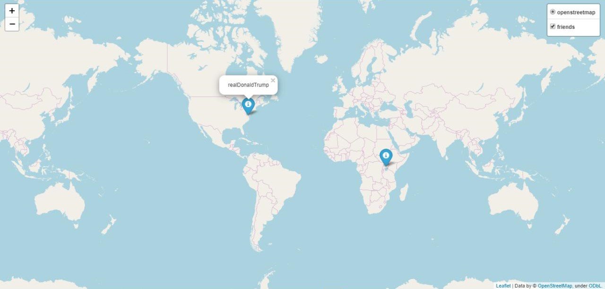

# FriendsMap

FriendsMap is a Python modules for creating a map with your map.


## Important

You must print your keys in **hidden.py**


## Usage

```python
import urllib.request, urllib.parse, urllib.error
connection = urllib.request.urlopen(url, context=ctx)
data = connection.read().decode()

import json
js = json.loads(data)

import ssl
ctx = ssl.create_default_context()
ctx.check_hostname = False
ctx.verify_mode = ssl.CERT_NONE

import folium
map_1 = folium.Map() # creates a map
fg = folium.FeatureGroup() # creates a layer
fg.add_child(folium.Marker()) # edits a layer
map_1.add_child(folium.LayerControl()) # separetes layers
map_1.save('Map_1.html') # creates the html file

from geopy.geocoders import Nominatim
geolocator = Nominatim(user_agent="specify_your_app_name_here", timeout=3)  # finds location:
geolocator.geocode("Lviv").latitude, geolocator.geocode("Lviv").longitude]) # latitude and longitude

```

## Conclusion

With this modules you can create a map with your friends. Also you can turn on this layer and turn off.

